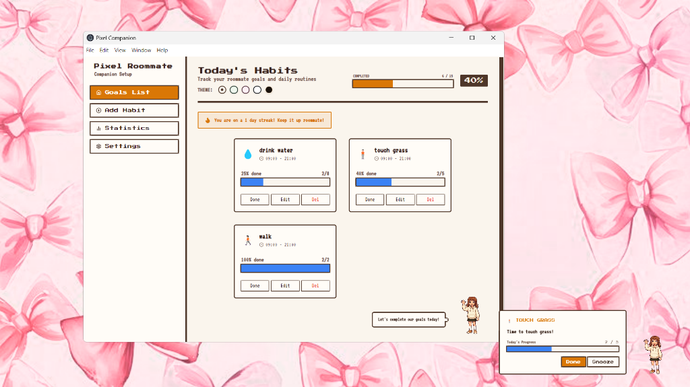
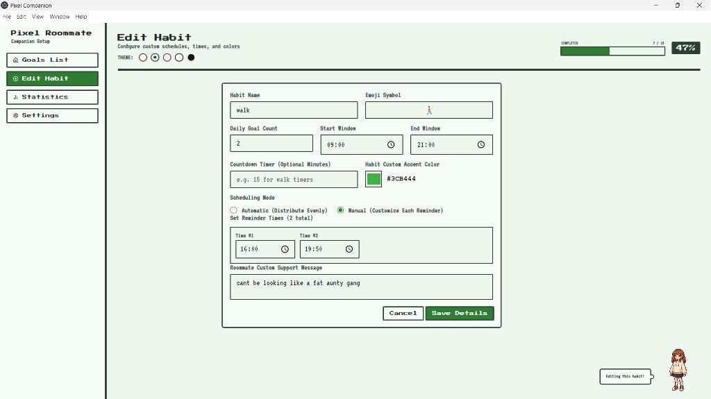
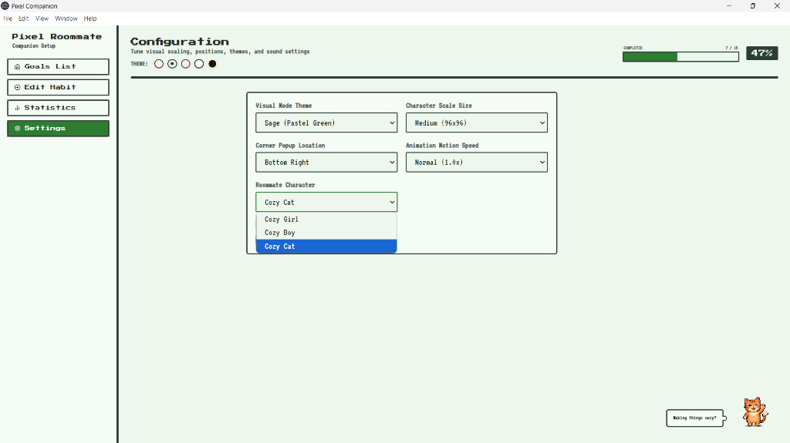

# Pixel Companion 👾

A JRPG style habit tracker and floating roommate companion that triggers desktop reminders to help you stay on top of your daily routines.

## Features

- **Cozy Roommate Companion:** A small desktop character (girl, boy, or cat) that walks onto your screen to remind you of your habits.
- **Retro Themes:** Choose between Creme (cozy JRPG beige), Sage (pastel green), Sakura (pastel pink), White (minimalist), or Cozy Midnight (dark mode) themes.
- **Custom scheduling:** Schedule automatic evenly distributed goals or set exact manual reminder times.
- **Supportive Messages:** Set custom supportive messages to motivate yourself (e.g. "cant be looking like a fat aunty gang").

## Screenshots

### Main Dashboard


### Edit Habit


### Cozy Settings


## Running Locally

To run this roommate companion on your machine:

1. Clone this repository.
2. Install dependencies:
   ```bash
   npm install
   ```
3. Run the development server and Electron shell:
   ```bash
   npm start
   ```

*Note: For the best desktop experience, keep this running in the background.*
